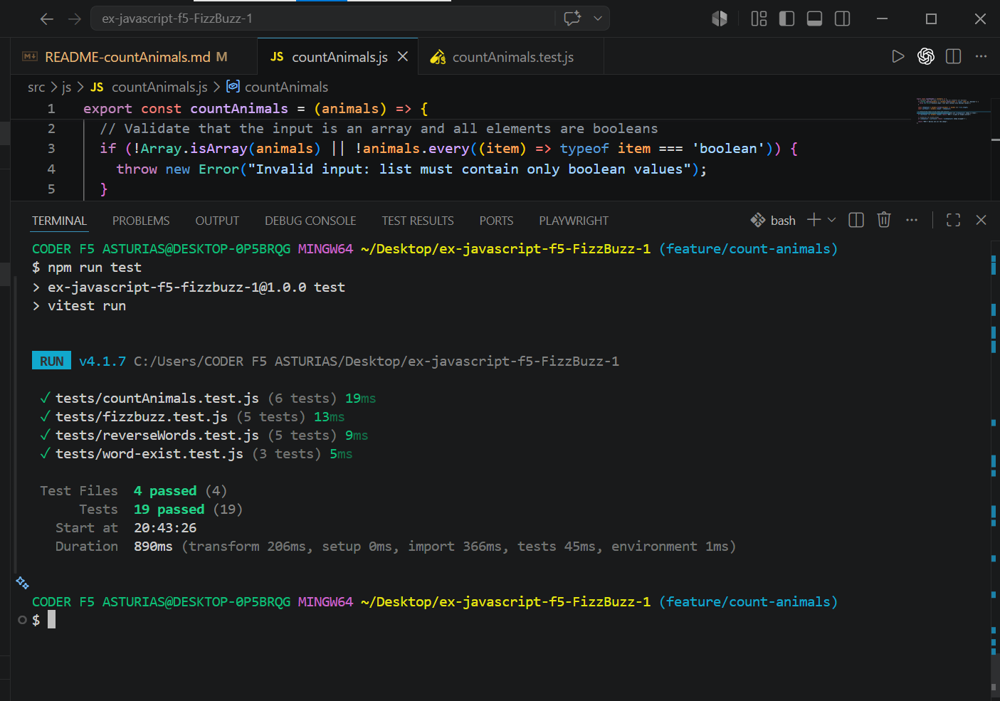

# Count Animals Project

This project implements a function that counts the number of sheep (true) and detects if wolves (false) have eaten them based on a provided list of boolean values.

## Features
- **Input Validation:** Ensures the input is an array and contains only boolean values.
- **Logical Scenarios:** Handles multiple cases including sheep dominance, wolf dominance, and exclusive groups.

## Installation and Running
1. Install dependencies:
   ```bash
   npm install

  ### Test Results
  
  The image below shows all 19 tests passing successfully across all project modules, including FizzBuzz, Reverse Words, Word Exist, and Count Animals, covering all validation and logic requirements.
